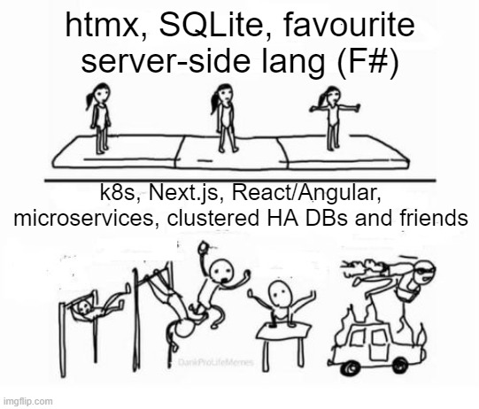

### Why?

TLDR (click me)

[Here](https://twitter.com/HotzWilton/status/1748650234752762364) the inspirational question from [X](https://x.com).

However, it started from reading [this](https://twitter.com/tastapod/status/1748266819570250002) post and responding with [that](https://twitter.com/raimeyuu/status/1748295153238827154) post.

### What?
A tiny showcase on how one can build great products, starting small and focusing on providing value, building neat experiences by utilizing hypermedia, F# and other tools.

### How?

Sample based on the [great work](https://github.com/galassie/FalcoSample) done by [Enrico Galassi](https://github.com/galassie) 🙏.

Libraries used:
* [Falco](https://www.falcoframework.com/)
* [htmx](https://htmx.org/)
* [Donald](https://github.com/pimbrouwers/Donald)
* [SQLite](https://www.sqlite.org/index.html)
* [Falco.Htmx](https://github.com/dpraimeyuu/Falco.Htmx)